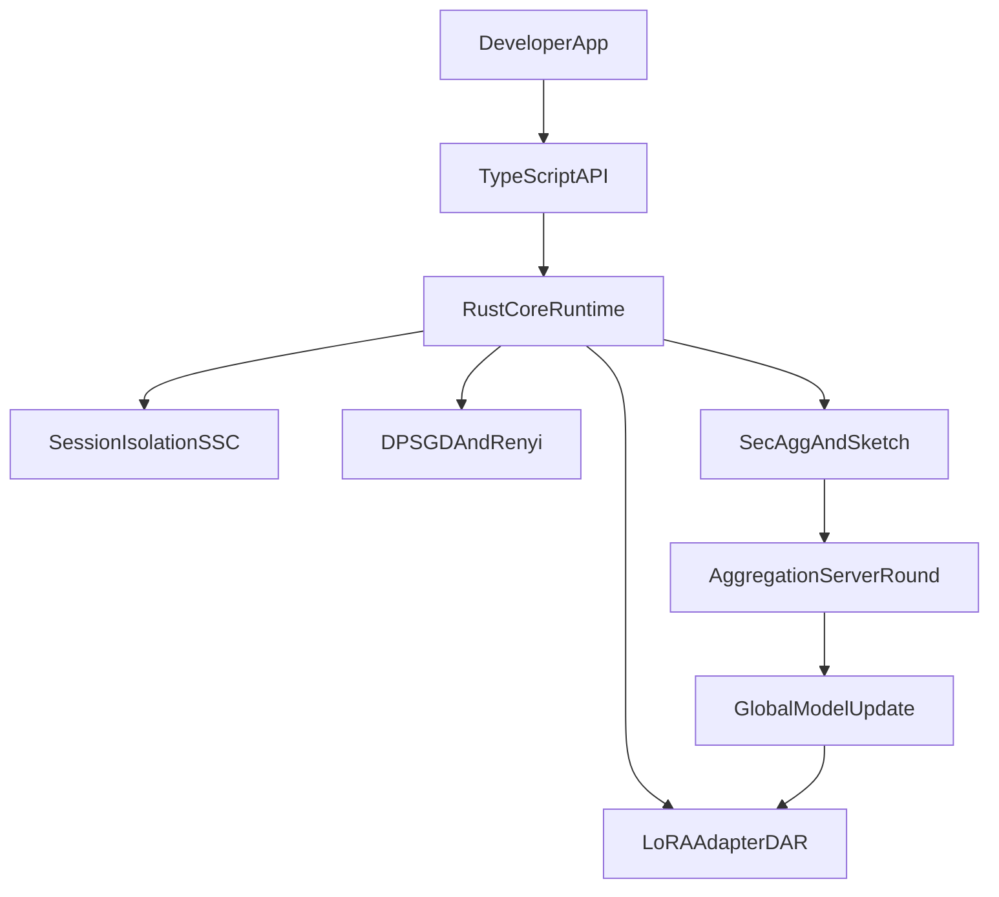

# FedLearn Learning Map Functions and Interactions

## Purpose
This file helps you learn how modules and functions work together while the project is being built.  
Style: two-tier explanation (plain summary first, technical mapping second).

## Big Picture (Simple)
FedLearn separates learning into layers:
- global model improvements (shared),
- personal adapter learning (per user),
- private session learning state (ephemeral).

This separation lets the system personalize without centralizing raw user data.

## Big Picture (Technical)
- Core runtime: Rust + CPU/CUDA/WASM targets
- Public developer surface: TypeScript package
- Privacy path: DP-SGD + Renyi accounting + secure aggregation
- Continual learning path: LoRA + EWC/GEM + dynamic rank (DAR)
- Server path: round lifecycle + filtering + trust updates

---

## Runtime Flow Map

### User Session to Federation Flow (Simple)
1. App loads adapter.
2. App opens session and learns from interactions.
3. Session closes and emits adapter delta.
4. Adapter applies delta with forget-resistance controls.
5. Optional contribution goes through DP + secure aggregation.
6. Server aggregates and sends global update back.

### User Session to Federation Flow (Technical)

```mermaid
flowchart LR
    loadAdapter[LocalAdapter.load] --> beginSession[adapter.beginSession]
    beginSession --> learnStep[session.learn]
    learnStep --> closeSession[session.close]
    closeSession --> applyDelta[adapter.apply]
    applyDelta --> contribute[adapter.contributeToGlobal]
    contribute --> registerRound[round.register]
    registerRound --> submitUpdate[round.submitMaskedUpdate]
    submitUpdate --> serverAggregate[server.aggregateRound]
    serverAggregate --> distributeResult[round.result]
    distributeResult --> loadAdapter
```

---

## Module Map (Mid-Level Function Relationships)

## 1) Adapter Module (`adapter/*`)
**Simple:** manages personal memory as LoRA adapter state.  
**Technical:** hosts rank/state, merge logic, cold-start, and dynamic rank transitions.

- `LoraAdapter`  
  - Responsibility: own per-user adapter state and metadata.  
  - Inputs/Outputs: takes `LoraDelta`, outputs updated adapter weights/state.  
  - Called by: session close/apply flow, contribution path.  
  - Calls into: rank scheduler and merge utilities.  
  - Invariant: rank stays inside allowed bounds.

- `DarScheduler.afterSession(...)`  
  - Responsibility: decide rank expansion/contraction based on session drift signal.  
  - Inputs/Outputs: probe distributions/metrics -> updated rank action.  
  - Called by: post-session update path.  
  - Calls into: rank expand/contract operations.  
  - Invariant: no direct external rank mutation bypass.

- `coldStart.svdInit(...)`  
  - Responsibility: initialize new user adapter safely from global weights.  
  - Inputs/Outputs: global layer weights -> initial `A/B` matrices.  
  - Called by: first-time adapter load.  
  - Invariant: no disruptive initial behavior.

## 2) Continual Learning Module (`continual/*`)
**Simple:** helps model learn new things without forgetting old patterns.  
**Technical:** EWC/GEM provide controlled update constraints.

- `computeFimFromProxy(...)`  
  - Responsibility: estimate weight importance from public proxy corpus.  
  - Inputs/Outputs: proxy corpus -> fisher diagonal estimate.  
  - Called by: EWC update setup.  
  - Invariant: uses proxy corpus only, never private interactions.

- `ewcLoss(...)`  
  - Responsibility: add forget-resistance penalty during updates.  
  - Inputs/Outputs: task loss + fisher + params -> penalized loss.  
  - Called by: adapter update training step.  
  - Invariant: penalty weighting remains controlled and bounded.

- `projectGradientGem(...)`  
  - Responsibility: project gradients to reduce interference with prior memory.  
  - Inputs/Outputs: candidate gradient + memory constraints -> projected gradient.  
  - Called by: continual training path when GEM enabled.  
  - Invariant: projection should not destabilize optimization.

## 3) Privacy Module (`privacy/*`)
**Simple:** ensures updates are privacy-preserving and budgeted.  
**Technical:** applies clipping/noise and tracks cumulative privacy spend.

- `dpSgdStep(...)`  
  - Responsibility: clip per-sample gradients and add calibrated noise.  
  - Inputs/Outputs: batch gradients + config -> noised aggregate gradient.  
  - Called by: contribution path.  
  - Invariant: noise added exactly once in approved path.

- `renyiAccountant.step(...)` and `computeEpsilon(...)`  
  - Responsibility: track moments and compute privacy spend.  
  - Inputs/Outputs: step parameters -> updated epsilon state.  
  - Called by: contribution and budget update flow.  
  - Invariant: numeric consistency against reference checks.

- `budget.verifyAndUpdate(...)`  
  - Responsibility: protect/validate budget state integrity and exhaustion logic.  
  - Inputs/Outputs: signed state + new usage -> updated signed state or error.  
  - Called by: pre/post contribution flow.  
  - Invariant: tampered state is rejected or reset per policy.

## 4) Session Module (`session/*`)
**Simple:** contains private in-session learning that should never persist raw state.  
**Technical:** wraps session lifetime and SSC-based delta derivation.

- `Session.begin(...)`  
  - Responsibility: open isolated learning context tied to adapter lifecycle.  
  - Inputs/Outputs: adapter reference -> session handle.  
  - Called by: app/session start path.  
  - Invariant: session remains volatile scope only.

- `Session.learn(...)`  
  - Responsibility: consume interaction stream into session learning state.  
  - Inputs/Outputs: interactions -> updated transient session state.  
  - Called by: app loop.  
  - Invariant: no persistence of raw interaction gradient state.

- `Session.close(...)`  
  - Responsibility: derive `LoraDelta` and end session safely.  
  - Inputs/Outputs: session state -> typed delta.  
  - Called by: end-of-session flow.  
  - Invariant: state zeroing/consumption semantics hold.

## 5) Crypto/Federation Module (`crypto/*`, `federation/*`)
**Simple:** sends privacy-protected contributions for shared learning.  
**Technical:** key agreement, masking, sketching, and round participation.

- `secagg.keyAgreement(...)`  
  - Responsibility: derive peer secrets for round masks.  
  - Inputs/Outputs: local/peer keys -> shared secrets.  
  - Called by: round registration pipeline.  
  - Invariant: per-round secret correctness.

- `secagg.maskGradient(...)`  
  - Responsibility: mask local contribution before transmission.  
  - Inputs/Outputs: gradient + masks -> masked payload.  
  - Called by: round submit path.  
  - Invariant: masks cancel only in aggregate.

- `sketch.compress(...)`  
  - Responsibility: create compressed signal for anomaly filtering.  
  - Inputs/Outputs: gradient -> sketch representation.  
  - Called by: contribution submit path.  
  - Invariant: sketch utility vs leakage tradeoff controlled.

- `FederationClient.contributeRound(...)`  
  - Responsibility: orchestrate register/submit/result client lifecycle.  
  - Inputs/Outputs: local delta/config -> round result and global update.  
  - Called by: adapter contribution API.  
  - Invariant: mode compatibility with server protocol.

## 6) Server Module (`fedlearn-server/*`)
**Simple:** manages federated rounds and publishes global updates.  
**Technical:** state machine, filtering, weighted aggregation, distribution.

- `roundManager.startRound(...)`  
  - Responsibility: open and manage round lifecycle states.  
  - Inputs/Outputs: participants/timing -> round state transitions.  
  - Called by: scheduler or trigger conditions.  
  - Invariant: state transitions follow defined order.

- `byzantine.filterSketches(...)`  
  - Responsibility: flag suspicious contributions pre-aggregation.  
  - Inputs/Outputs: sketches -> include/exclude decisions.  
  - Called by: filtering state.  
  - Invariant: filtering does not violate core privacy assumptions.

- `trustRegistry.updateScores(...)`  
  - Responsibility: update trust history and temporary bans.  
  - Inputs/Outputs: contribution impact signals -> updated trust weights.  
  - Called by: post-round evaluation.
  - Invariant: score updates are bounded and auditable.

- `aggregation.applyWeightedUpdate(...)`  
  - Responsibility: produce final global model delta for distribution.  
  - Inputs/Outputs: accepted updates + weights -> global delta.  
  - Called by: aggregation state.  
  - Invariant: only allowed contributions influence output.

---

## What to Update in This File During Build
At each sector closeout:
- Add newly implemented function/class names.
- Update called-by/calls-into links.
- Note new invariants and where they are enforced.
- Mark any changed flow (especially security/privacy-relevant flow).

## Current Learning Focus by Sector
- S01-S04: determinism + adapter + continual learning + privacy accounting
- S05-S07: session isolation + secagg + server lifecycle
- S08-S09: rank dynamics + adversarial robustness
- S10-S12: browser runtime + privacy UX + integration/release evidence

## Current Implemented Snapshot (Sector 01)
- Workspace:
  - `Cargo.toml` (workspace root)
  - `crates/fedlearn-core/Cargo.toml`
- Implemented functions in `crates/fedlearn-core/src/determinism.rs`:
  - `hkdf_seed(device_secret, round_number)` -> derives deterministic 32-byte seed
  - `deterministic_rng(device_secret, round_number)` -> seeded `ChaCha20Rng`
  - `deterministic_noise_bytes(device_secret, round_number, len)` -> reproducible byte stream
  - `DeterministicFloat` trait (`add_det`, `mul_det`) for explicit deterministic math calls
- Test scaffolding:
  - `tests/determinism/cross_backend.rs`
  - `tests/determinism/reference_vectors.json`
- Validation:
  - `crates/fedlearn-core/tests/cross_backend.rs` executes successfully via workspace tests.

## Current Implemented Snapshot (Sector 02)
- New modules:
  - `crates/fedlearn-core/src/adapter/lora.rs`
  - `crates/fedlearn-core/src/adapter/dar.rs`
  - `crates/fedlearn-core/src/adapter/cold_start.rs`
- New functions:
  - `validate_rank(rank)` -> enforces even rank in `[4,16]`
  - `matmul(a,b)` -> baseline matrix multiplication for adapter math
  - `merge_weights(base,a,b)` -> computes `W + A*B`
  - `DarScheduler.next_rank(current_rank, kl)` -> rank adjust logic
  - `svd_style_cold_start(...)` -> scaffold initializer preserving `A*B=0`
- Validation:
  - `crates/fedlearn-core/tests/adapter.rs` (rank bounds, merge correctness, cold-start invariant, DAR threshold behavior).

## Current Implemented Snapshot (Sector 03)
- New modules:
  - `crates/fedlearn-core/src/continual/ewc.rs`
  - `crates/fedlearn-core/src/continual/gem.rs`
- New functions:
  - `load_proxy_corpus(path)` -> parses JSONL proxy dataset with minimum-size gate
  - `compute_fim_proxy_only(path, param_dim)` -> scaffold Fisher diagonal from proxy corpus
  - `ewc_loss(task_loss, fisher, current, previous, lambda)` -> applies Fisher-weighted drift penalty
  - `project_gradient(candidate, memory_reference)` -> conflict-aware gradient projection scaffold
- Validation:
  - `crates/fedlearn-core/tests/continual.rs` (proxy minimum guard, FIM shape, EWC penalty, GEM projection).

## Current Implemented Snapshot (Sector 04)
- New modules:
  - `crates/fedlearn-core/src/privacy/dp_sgd.rs`
  - `crates/fedlearn-core/src/privacy/renyi.rs`
  - `crates/fedlearn-core/src/privacy/budget.rs`
- New functions:
  - `dp_sgd_step(gradients, clip_norm, noise_multiplier)` -> clipped aggregate scaffold
  - `RenyiAccountant.step(sigma)` and `compute_epsilon(delta)` -> privacy spend scaffold
  - `BudgetState.sign(secret)` and `verify(secret)` -> tamper-evident integrity checks
- Validation:
  - `crates/fedlearn-core/tests/privacy.rs` (config validation, epsilon trend, budget tamper detection).

## Current Implemented Snapshot (Sector 05)
- New modules:
  - `crates/fedlearn-core/src/session/session.rs`
  - `crates/fedlearn-core/src/session/ssc.rs`
- New functions:
  - `LoraAdapter::begin_session(session_id)` -> opens volatile session context
  - `Session.learn(interactions)` -> updates SSC state and interaction count
  - `Session.close()` -> derives `LoraDelta`, increments `session_count`, zeroes SSC state
  - `SscEncoder.embedding()` and `zero_state()` -> session state projection + cleanup
- Invariant checks:
  - `Session` is non-`Send`/non-`Sync` (`PhantomData<*mut ()>` and static assertion test)
  - `Drop` path zeroes SSC state.
- Validation:
  - `crates/fedlearn-core/tests/session.rs` (counter update, close delta, session count increment).

## Current Implemented Snapshot (Sector 06)
- New modules:
  - `crates/fedlearn-core/src/crypto/secagg.rs`
  - `crates/fedlearn-core/src/crypto/sketch.rs`
- New functions:
  - `mask_update(me, peers, gradient)` -> pairwise signed mask composition scaffold
  - `aggregate_masked(updates)` -> aggregate masked updates
  - `CountSketch::compress(gradient)` -> compressed signal for anomaly filtering
  - `cosine_similarity(a,b)` -> similarity metric in sketch space
- Validation:
  - `crates/fedlearn-core/tests/crypto.rs` (mask cancellation and sketch behavior).

## Current Implemented Snapshot (Sector 07)
- New crate:
  - `crates/fedlearn-server`
- New server functions:
  - `RoundManager::start_round()` -> initializes round and enters `Registering`
  - `register_device(device_id)` -> participant tracking in registration state
  - `begin_collection/filtering/aggregation/distribution/complete_round()` -> state transitions
  - `submit_update(submission)` -> in-memory update collection for registered devices
- New API endpoints (local scaffold):
  - `POST /round/start`
  - `POST /round/register`
  - `POST /round/submit`
- Validation:
  - `crates/fedlearn-server/tests/round.rs` (state progression and unregistered-submission rejection).

## Current Implemented Snapshot (Sector 08)
- Updated module:
  - `crates/fedlearn-core/src/adapter/cold_start.rs`
- New functions/types:
  - `WarmUpState::new(config)` -> initializes warm-up lifecycle tracker
  - `WarmUpState::is_warming_up()` -> indicates pre-federation warm-up window
  - `WarmUpState::current_lr_multiplier()` -> returns boosted vs normal LR multiplier
  - `WarmUpState::advance_session()` -> advances warm-up progression per completed session
- Validation:
  - Added adapter tests for rank caps and warm-up transition in `crates/fedlearn-core/tests/adapter.rs`.

## Current Implemented Snapshot (Sector 09)
- New server modules:
  - `crates/fedlearn-server/src/trust.rs`
  - `crates/fedlearn-server/src/byzantine.rs`
- New functions:
  - `TrustRegistry::update(device_id, delta_loss_sign)` -> EMA-style trust update
  - `TrustRegistry::is_banned(device_id)` -> ban threshold check
  - `TrustRegistry::normalized_weights(ids, temperature)` -> softmax-like contribution weighting
  - `filter_by_sketch_consensus(device_ids, sketches, threshold)` -> byzantine outlier filtering
- Validation:
  - `crates/fedlearn-server/tests/byzantine.rs` (ban threshold, normalized weight sum, outlier exclusion).

## Current Implemented Snapshot (Sector 10)
- New runtime crate:
  - `crates/fedlearn-wasm`
- New wasm exports:
  - `health_check()` -> wasm runtime health payload
  - `deterministic_noise_hex(secret, round, len)` -> deterministic noise bridge for browser path checks
- New JS package scaffold:
  - `packages/fedlearn-js/src/index.ts`
  - `packages/fedlearn-js/src/browser/wasm_loader.ts`
  - `packages/fedlearn-js/src/browser/dashboard.ts`
- Validation:
  - `crates/fedlearn-wasm/tests/smoke.rs` + full workspace test pass.

## Current Implemented Snapshot (Sector 11)
- New browser visualization helpers:
  - `buildPrivacyDashboardText(model)` -> standardized privacy panel text lines
  - `buildHeatMapModel(values)` -> matrix to layer/head cell representation
  - `normalizeIntensity(model)` -> normalized heatmap intensities
- Exported through:
  - `packages/fedlearn-js/src/index.ts`
- Validation:
  - package build passed (`npm run build` in `packages/fedlearn-js`)
  - helper test scaffolds added for dashboard and heatmap logic.

## Current Implemented Snapshot (Sector 12)
- Integration scripts:
  - `npm run verify:all` at repo root (`test:rust` + `build:js`)
  - `scripts/simulate_federation.py` (scaffold command surface)
  - `scripts/benchmark_modal.py` (scaffold benchmark entrypoint)
- Documentation baseline:
  - `docs/ARCHITECTURE.md`
  - `docs/PRIVACY_GUARANTEES.md`
  - `docs/API_REFERENCE.md`
  - `docs/BROWSER_GUIDE.md`
- Release posture:
  - local integration checks pass
  - npm publish intentionally not executed.

## Current Implemented Snapshot (Hardening + Advanced Spec Pass)
- R-01 browser path:
  - `initWasm()` now performs fetch + instantiate.
  - `selectBackends()` enforces WASM training path.
- R-02/R-04 privacy/determinism:
  - `RenyiAccountant.step(sigma, sampling_rate)` and expanded determinism vectors.
  - `epsilon_cost_for_proxy_fim()` explicitly returns zero.
- R-03/R-07 adapter:
  - `svd_from_weight()` for SVD-based init.
  - `expand_rank_svd()` / `contract_rank_truncate()` for rank transitions.
  - `DarScheduler::kl_probe()` for measured rank signal utility.
- R-05/R-06 crypto/federation/server:
  - secagg mask path upgraded with X25519/HKDF/ChaCha20 primitives.
  - SCAFFOLD/FedProx modules added.
  - Round manager supports filtered weighted aggregate and soft-label aggregation.
- R-08 + advanced paths:
  - SSC upgraded to two-stage encoding and projection helper.
  - HE tier primitives: quantize/dequantize path for encrypted flow scaffolding.

## Current Implemented Snapshot (Cursor Context Compliance Pass)
- Dependency + CI posture:
  - pinned dependency versions in core/server/js package manifests.
  - CI workflow added for rust tests, determinism gate, privacy validation, JS build.
- Storage compliance:
  - browser adapter persistence contract in `adapter_store.ts` with forbidden session-state guardrails.
- CUDA/performance artifacts:
  - new `crates/fedlearn-cuda` with kernel files (`dp_sgd.cu`, `ewc.cu`, `lora_merge.cu`).
  - benchmark harness emits results JSON from `scripts/benchmark_modal.py`.
- Integration depth:
  - accountant validation test and adversarial server tests added.

## Current Implemented Snapshot (Release Hardening Gate)
- Package/release controls:
  - `packages/fedlearn-js/package.json` now includes release metadata fields and export/files controls.
- Determinism/privacy:
  - `deterministic_noise_is_stable_across_multiple_vectors()` now validates fixed expected byte vectors.
  - `accountant_known_value_regression()` adds deterministic regression behavior check for epsilon path.
  - `validateNoForbiddenFields()` is exported for direct guardrail verification.
- SecAgg and server resilience:
  - `secagg_dropout_still_aggregates_survivor_with_drift_bound()` validates dropout boundary behavior.
  - `poisoning_threshold_matrix_has_expected_sensitivity()` validates threshold sensitivity ordering.
  - `RoundManager` transition methods now gate on participant/submission presence.
- Evidence generation:
  - `scripts/benchmark_modal.py` now emits:
    - `artifacts/release_hardening/benchmark_results.json`
    - `artifacts/release_hardening/adversarial_calibration_report.json`
    - `artifacts/release_hardening/non_iid_summary.json`
