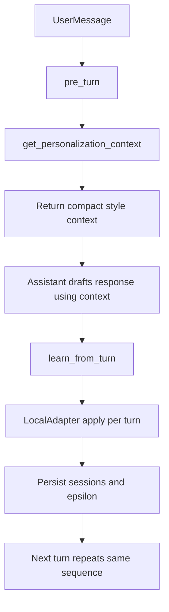

# FedLearn MCP Integration

This document explains how to wire FedLearn local continual learning into **Cursor, Claude Desktop, and AntiGravity** via MCP.

## Modes

### Best-effort mode (raw MCP tools)

In this mode, the chat client decides whether/when to call tools. It can work, but some turns may skip updates.

Use tools in this order each exchange:
1. `pre_turn`
2. `get_personalization_context`
3. assistant response generation conditioned on returned context
4. `learn_from_turn`

### Guaranteed mode (orchestrator wrapper)

Use `@viyrockan/fedlearn-orchestrator` to enforce tool calls from host code every exchange. This removes dependence on model tool-choice heuristics.

### Guaranteed local chat (no MCP, no Cursor)

When you need **deterministic** persistence on every line without any chat client deciding whether to call tools, use the built-in REPL. It calls `LocalAdapter` directly (same store as `fedlearn-ui`):

```bash
npm run build --prefix packages/fedlearn-orchestrator
node packages/fedlearn-orchestrator/bin/fedlearn-guaranteed-chat.mjs --user-id check-five
```

Optional one-shot:

```bash
node packages/fedlearn-orchestrator/bin/fedlearn-guaranteed-chat.mjs --user-id check-five --once your message here
```

Runs with **zero external API**: replies are echoed with `[fedlearn-local-echo]` unless you integrate your own generator via `createGuaranteedLocalRunner` in code.

### Fourth path — Cursor disk watcher (no MCP per message)

Because Cursor chat does not guarantee MCP tool calls every turn, you can **`@viyrockan/fedlearn-watcher`**: poll Cursor’s SQLite **read-only** (merged **global** `User/globalStorage/state.vscdb` + **workspace-scoped** `User/workspaceStorage/<id>/state.vscdb`), extract composer prompts from **`aiService.generations`**, pair turns, call `LocalAdapter` learn/apply, and regenerate **`.cursor/rules/fedlearn.generated.mdc`** when new pairs arrive.

Important: Composer **assistant bodies are often absent** from SQLite. By default FedLearn emits a clear **placeholder assistant line** so learning can proceed; set **`FEDLEARN_WATCHER_SYNTH_ASSISTANT=0`** to disable that pairing behavior.

Honesty constraint: bullets in `.mdc` describe **patterns observed from recent user messages**, not adapter-weight inference.

```bash
npm run build --prefix packages/fedlearn-watcher
FEDLEARN_USER_ID=check-five node packages/fedlearn-watcher/bin/fedlearn-watcher.mjs run --workspace-root .
node packages/fedlearn-watcher/bin/fedlearn-watcher.mjs inspect --workspace-root . --dump-sample
```

If counts stay at zero after a Cursor upgrade, re-run **`inspect`** and note whether `workspace state.vscdb` resolved (`--workspace-root` must match the folder Cursor opened—see `workspaceStorage/*/workspace.json`). On `SQLITE_BUSY`, raise `--poll-ms` / `FEDLEARN_WATCHER_LOOKBACK_MS`. Startup appends `.fedlearn/` to an existing `.gitignore` only.

## What you get

Reliable 4-step flow per assistant reply:

1. `pre_turn(userId?, conversationId, latestInput?)` for immediate micro-progress update.
2. `get_personalization_context(userId?, conversationId, latestInput?)` before drafting.
3. Assistant conditions response style/format/detail on returned context.
4. `learn_from_turn(userId?, conversationId, input, output)` after final answer.

`learn_from_turn` applies immediately on each call.

## Workflow (high-level)



## Package

Install:

```bash
npm i fedlearn-core @viyrockan/fedlearn-mcp @viyrockan/fedlearn-orchestrator
```

Run the MCP server as a stdio process (Cursor/Claude Desktop/AntiGravity usually spawn it automatically):

```bash
npx fedlearn-mcp
```

## Guaranteed mode usage

```ts
import { runTurn, createCursorAdapter } from "@viyrockan/fedlearn-orchestrator";

const reply = await runTurn({
  userId: "check-five",
  conversationId: "thread-42",
  userInput: "Can you summarize this in short bullet points?",
  modelAdapter: createCursorAdapter(async ({ userInput, personalizationContext }) => {
    // call your client/provider model here
    return `Reply for ${userInput}\nContext: ${personalizationContext}`;
  }),
  mcp: {
    callTool: async (name, args) => {
      // wire this to your MCP client call primitive
      return await callMcpTool(name, args);
    }
  },
  turnId: "thread-42-turn-001"
});
```

`runTurn(...)` always executes:
`pre_turn` -> `get_personalization_context` -> model response -> `learn_from_turn`.

## Tool: `pre_turn`

**Input schema**

- `userId` (optional): stable id for local persistence  
  Default: `process.env.FEDLEARN_USER_ID` (or `fedlearn-mcp-user`)
- `conversationId` (required): stable id for the current chat thread
- `latestInput` (optional): latest user prompt

**Output**

- A short summary with:
  - `turnsInSession` (ephemeral)
  - micro+macro personalization %
  - current budget and rank snapshot

## Tool: `get_personalization_context`

**Input schema**

- `userId` (optional): stable id for local persistence  
  Default: `process.env.FEDLEARN_USER_ID` (or `fedlearn-mcp-user`)
- `conversationId` (required): stable id for the current chat thread
- `latestInput` (optional): latest user prompt for moderate-token inference

**Output**

- A compact personalization context string with:
  - `sessionsRetained`, personalization %, budget remaining, rank
  - inferred `tone`, `format`, `detail` preference
  - confidence level + fallback note when confidence is low

## Tool: `learn_from_turn`

**Input schema**

- `userId` (optional): stable id for local persistence  
  Default: `process.env.FEDLEARN_USER_ID` (or `fedlearn-mcp-user`)
- `conversationId` (required): stable id for the current chat thread
- `input` (required): the user prompt text
- `output` (required): the assistant response text
- `turnId` (optional): idempotency key for retry-safe duplicate protection

**Output**

- A short text summary that includes:
  - `sessionsRetained`
  - personalization %
  - budget remaining
  - rank label
  - explicit confirmation that learning was applied on this turn

## Sample tool payloads

```json
{
  "name": "pre_turn",
  "arguments": {
    "userId": "check-five",
    "conversationId": "thread-42",
    "latestInput": "Can you summarize this in short bullet points?"
  }
}
```

```json
{
  "name": "get_personalization_context",
  "arguments": {
    "userId": "check-five",
    "conversationId": "thread-42",
    "latestInput": "Can you summarize this in short bullet points?"
  }
}
```

```json
{
  "name": "learn_from_turn",
  "arguments": {
    "userId": "check-five",
    "conversationId": "thread-42",
    "input": "Can you summarize this in short bullet points?",
    "output": "Here are the key points..."
  }
}
```

## Tool: `flush_conversation` (optional)

If Cursor/Claude Desktop/AntiGravity can detect conversation end, call:

- `flush_conversation(userId?, conversationId)`

When apply-on-every-turn is enabled, this returns current summary and acts as a no-op.

## Local-only persistence / “zero paid services”

`@viyrockan/fedlearn-mcp` does not call any external training/federation services.  
All personalization state is written through the existing `fedlearn-core` local adapter persistence:
- default: `./.fedlearn-local-adapters.json` relative to the MCP server process working directory
- optional override: `FEDLEARN_LOCAL_STORE` (absolute path)

## Minimal verification checklist

1. Pick a stable `userId` (set `FEDLEARN_USER_ID`).
2. Run your MCP client and talk normally.
3. For one turn, verify strict order:
   - call `pre_turn`
   - call `get_personalization_context`
   - generate response conditioned on returned context
   - call `learn_from_turn` with `{ input, output }`
4. Re-check after 1-2 prompts within the same `conversationId`:
   - `npx @viyrockan/fedlearn-ui --user-id <userId> --once`
   - your chat client’s tool output text from `learn_from_turn`
5. Confirm increments:
   - percentage moves at pre-turn (micro progress)
   - `Sessions` increases
   - epsilon increases each learned turn (typically +0.01 for one interaction)

## Client snippets (guaranteed mode)

### Cursor host integration

- Wrap each outgoing user message using `runTurn(...)`.
- Use your MCP client bridge to execute `pre_turn/context/learn_from_turn`.
- Inject returned context into prompt assembly before generating reply.

### Claude Desktop host integration

- Use the same `runTurn(...)` call path from your desktop integration layer.
- Keep stable `userId` and `conversationId` to maintain deterministic session updates.

### AntiGravity host integration

- Route each turn through `runTurn(...)` before model generation.
- Persist `turnId` per turn so retries remain idempotent.

