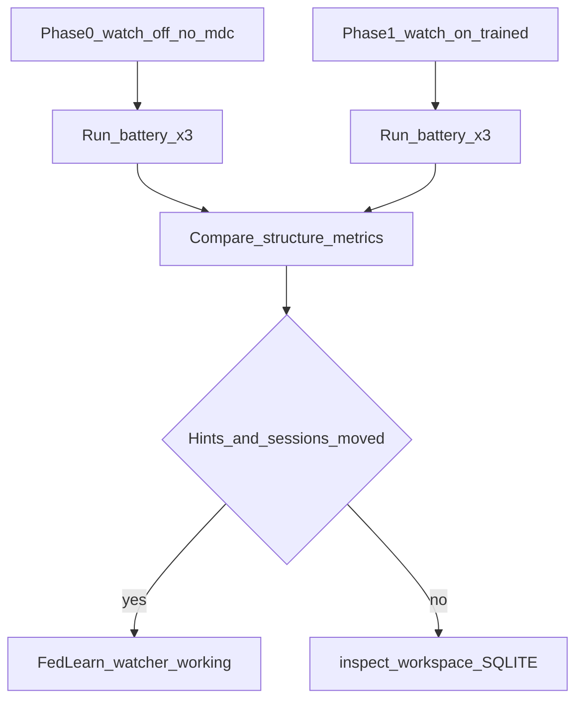

# Watcher-only friend validation (stronger effects + proof)

End-to-end guide for testing FedLearn on a **new Mac + Cursor** machine using **`npx @viyrockan/fedlearn watch`** only (no MCP). Companion docs:

- Fixed prompts: [fixtures/friend-validation-prompts.md](fixtures/friend-validation-prompts.md)
- Privacy: [FRIEND_VALIDATION_PRIVACY.md](FRIEND_VALIDATION_PRIVACY.md)
- Training messages: [../scripts/friend-validation/train-hint-messages.md](../scripts/friend-validation/train-hint-messages.md)

## Prerequisites

- macOS, **Node 20+** (`node -v`)
- Cursor with a real project opened as the **workspace root**
- Terminal `cd` to that same folder

## How pattern coverage works

**Pattern coverage %** is not a manual slider. It comes from `adaptivePct(sessionCount)` in `fedlearn-core` (sigmoid; default midpoint **15**, steepness **40**).

| Target % | Default curve (midpoint=15) | Experiment curve (`FEDLEARN_MIDPOINT=5`) |
|----------|-----------------------------|------------------------------------------|
| ~0% | 0 sessions | 0 sessions |
| ~60% | **16** sessions | **6** sessions |
| ~99%+ | **29+** sessions | **19+** sessions |

Print the curve:

```bash
npm run build:js --silent
node scripts/friend-validation/session-targets.mjs
node scripts/friend-validation/session-targets.mjs --midpoint 5
```

**What steers Agent answers:** `.cursor/rules/fedlearn.generated.mdc` → **Conversation pattern hints** (from recent user messages), not the % line alone.

## Part 1 — Three isolated profiles

Use separate `FEDLEARN_USER_ID` + `FEDLEARN_LOCAL_STORE` so sessions and hints do not bleed.

```bash
# From repo or any machine with npx
source /path/to/FedLearn/scripts/friend-validation/profile-env.example.sh low   # or mid | high
cd /path/to/cursor/workspace
npx -y @viyrockan/fedlearn inspect
npx -y @viyrockan/fedlearn watch
```

| Profile | Env | Target coverage | Training style |
|---------|-----|-----------------|----------------|
| **low** | `friend-low` | ~0% | Short neutral questions — see [train-hint-messages.md](../scripts/friend-validation/train-hint-messages.md) |
| **mid** | `friend-mid` + optional `FEDLEARN_MIDPOINT=5` | ~60% | Numbered lists + “at most 8 lines” |
| **high** | `friend-high` + optional `FEDLEARN_MIDPOINT=5` | ~99% | Long direct instructions + runbook headings |

After each profile’s training chats, run acceptance checks:

```bash
node scripts/friend-validation/check-acceptance.mjs --workspace-root .
npx -y @viyrockan/fedlearn --once
```

**Pass criteria for training:** `.mdc` exists; hint bullets **differ across profiles**; `sessions` and ε increase for mid/high.

## Part 2 — Fixed prompt battery

1. **New Agent chat** per prompt (see [friend-validation-prompts.md](fixtures/friend-validation-prompts.md)).
2. Run full battery per profile: A1–A3, B1–B3.
3. Record structure metrics (line count, headings, bold count) — not raw `.fedlearn/watcher-state.json`.

**Amplifier prompts:** B1 (four sections), B2 (8 lines), A2 (numbered list).  
**Null control:** B3 (idempotency) — expect small deltas.

## Part 3 — A/B control (prove FedLearn vs Cursor alone)



### Phase 0 — Control

1. Stop `watch` (Ctrl+C).
2. Rename or remove `.cursor/rules/fedlearn.generated.mdc` (e.g. `fedlearn.generated.mdc.off`).
3. Use a **fresh** `FEDLEARN_USER_ID` not trained, or keep control separate from experiment users.
4. Run the prompt battery **3 times** per key prompt (e.g. A1, B1); save outputs.

### Phase 1 — Treatment

1. Restore/watch on; train one profile (e.g. **mid**); confirm hints via `check-acceptance.mjs`.
2. Same battery, **3 runs** per prompt, new chats.

### Verdict

FedLearn watcher is **working** when:

| Check | Evidence |
|-------|----------|
| Ingest | `inspect` shows Cursor DB paths + turn counts after Composer use |
| Learn loop | Sessions ↑ in dashboard / `.mdc` after chats with `watch` running |
| Rules refresh | `.mdc` mtime changes; hint section differs after style training |
| A/B | Treatment replies show **repeated** structural shift vs Phase 0 (e.g. more bold/runbook on **high**) |
| Isolation | Separate stores per profile |
| Honest reporting | **60% vs 100%** duplicate text with **same hints** = plateau, not failure |

## Part 4 — Optional curve tuning

For demos that need **distinct** dashboard labels without 29+ sessions:

```bash
export FEDLEARN_MIDPOINT=5
export FEDLEARN_STEEPNESS=40
```

Document these env vars in test reports.

## Commands reference

```bash
npx -y @viyrockan/fedlearn inspect
npx -y @viyrockan/fedlearn watch
npx -y @viyrockan/fedlearn --once
npx -y fedlearn-core verify-local
node scripts/friend-validation/check-acceptance.mjs --workspace-root .
```

## Watcher-only ceiling

Generated rules state that hints are **observed patterns**, not neural adapter weights. Large answer changes require **contrasting hint bullets** + `alwaysApply: true`. Per-turn guaranteed context needs MCP/orchestrator ([MCP_INTEGRATION.md](MCP_INTEGRATION.md)) — out of scope for this runbook.

## Deliverable checklist (friend demo)

- [ ] Setup: Node 20+, env profiles, `inspect`, `watch`
- [ ] Three profiles trained with distinct message styles
- [ ] Acceptance JSON from `check-acceptance.mjs` per profile
- [ ] Prompt battery outputs (labeled files)
- [ ] A/B Phase 0 vs Phase 1 comparison table
- [ ] Privacy one-pager shared ([FRIEND_VALIDATION_PRIVACY.md](FRIEND_VALIDATION_PRIVACY.md))
